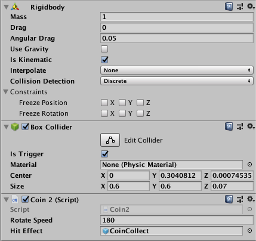

### 添加 Rigidbody 和 BoxCollider

取消重力: Use Gravity
设定为刚体: Is Kinematic
如果不需要阻挡物体,只做碰撞检测, 把 BoxCollider 的 Is Trigger 选上



### 添加脚本
```
void OnTriggerEnter(Collider other)
{
  // 如果碰撞进来的物体是玩家,销毁自己
  if (other.tag == "Player")
  {
    Destroy(gameObject);
  }
}
```